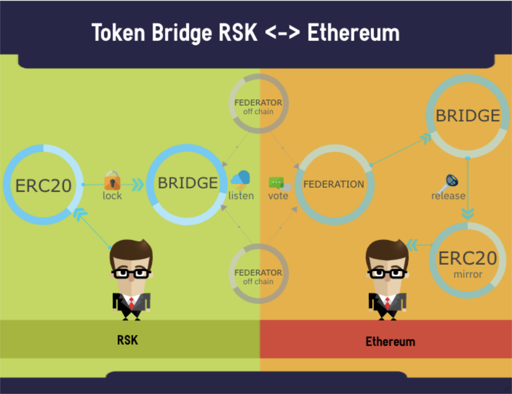

# RSK <-> ETH Token Bridge

Ethereum/RSK Bridge that allows to move ERC20 tokens from one chain to the other.

## Rationale

Cross chain events are very important in the future of crypto. Exchanging tokens between networks allows the token holders to use them in their favorite chain without beeing restricted to the contract owner network choice. Moreover this also allows layer 2 solutions to use the same tokens on different chains, this concept together with stable coins creates a great way of payment with low volatility across networks.

## Overview

The smart contract on each network are connected by bridges, a bridge on one chain would receive and lock the ERC20 tokens, this action emits an event that will be served to the bridge on the other chain. This interoperability is achieved using a Federation that sends the event from one contract to the other, once the bridge on the other chain receives the event from the Federation, it mints the tokens on the mirror ERC20 contract.
See the [FAQ](https://developers.rsk.co/tools/tokenbridge/faq/) to know more about how it works!

  

The bridges on each contract are upgradeable, this would enable a smooth transition to a more decentralized bridge in the future. Here's is a link to the first 
[POC of the trustless decentralized bridge](https://github.com/rsksmart/decentralized-tokenbridge)

## Usage

You can use the ['Token Bridge Dapp'](https://tokenbridge.rsk.co/) together with [Nifty Wallet](https://chrome.google.com/webstore/detail/nifty-wallet/jbdaocneiiinmjbjlgalhcelgbejmnid) or [Metamask with custom network](https://github.com/rsksmart/rskj/wiki/Configure-Metamask-to-connect-with-RSK) to move tokens between networks. This is the [Dapp guide](https://developers.rsk.co/tools/tokenbridge/dappguide/) if you don't know how to use it.
Or you can use a wallet with the abi of the contracts. See the ['interaction guide using MyCrypto'](https://developers.rsk.co/tools/tokenbridge/usingmycrypto/) for more information on how to use the bridge.

## Contracts deployed on RSK, Ethereum, RSK Testnet and Kovan

Here are the ['addresses'](./docs/ContractAddresses.md) of the deployed contracts in the different networks.

## Report Security Vulnerabilities

To report a vulnerability, please use the [vulnerability reporting guideline](./SECURITY.md) for details on how to do it.

## Developers

### Contracts

The smart contracts used by the bridge and the instructions to deploy them are in the ['bridge folder'](./bridge/README.md).
The ABI to interact with the contracts are in the ['abi folder'](./bridge/abi)

### Dapp

The dapp of the token bridge can be found in the ['UI Folder'](./ui)

### Federation

A federation sends notification of events happening in the bridge of one chain to another chain. The federation is composed of oracles listening to the events created in one chain and sending it to the other chain. When a majority of the federators votes on an event, the bridge accepts the event as valid and releases the tokens on the other chain.
See the ['federator'](./federator/README.md) for more information about federations.

### Integration Test

An integration test is prepared for contracts and federators. To properly run integration test, you need check network config in the `truffle-config.js` and `package.json` in `bridge` folder with your test chains' configuration before run `npm run deployIntegrationTest`.

For testing purposes only, an empty `test.local.federator.key` file is available in `federator/config`, which fulfills the role that a `federator.key` file would have in production.
Also, a `test.local.config.js` configuration is provided in `federator/config` for the same purpose, acting as the `config.js` file would in a productive environment.

1. Check `mnemonic.key` in `bridge`
1. Check `infura.key` in `bridge`
1. Check your `networkName` in `bridge/migrations/4_deploy_erc1820.js` when your test network does not have **ERC1820:Pseudo-introspection Registry Contract** deployed.

Then
1. run `npm run deployIntegrationTest` in `bridge`
1. run `npm run integrationTest` in `federator`
