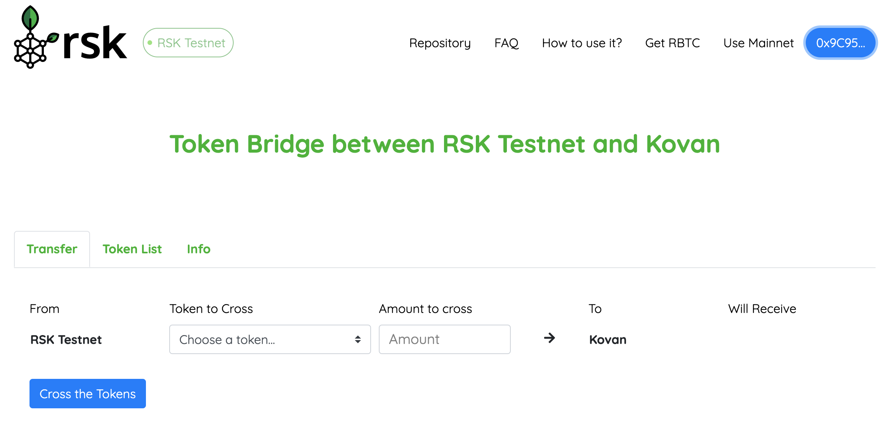
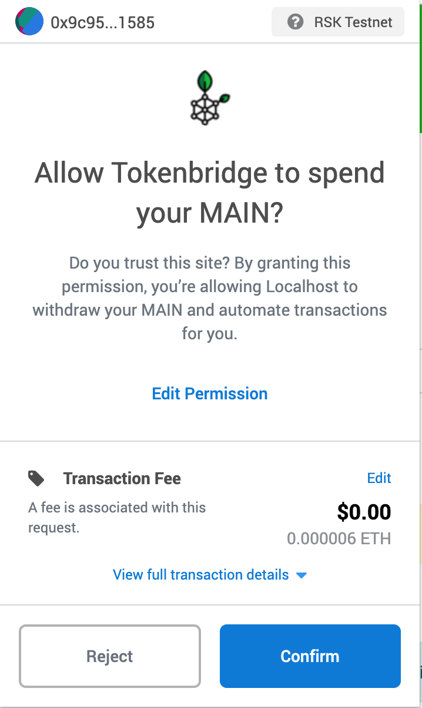
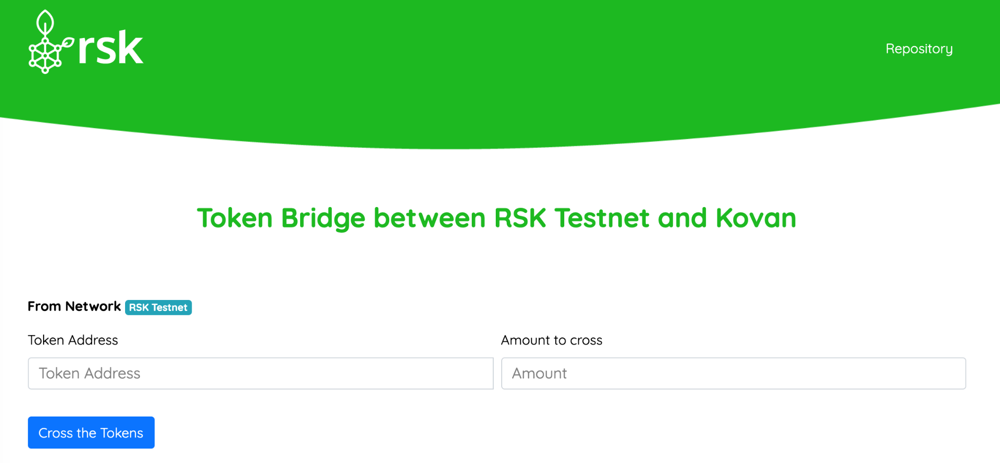
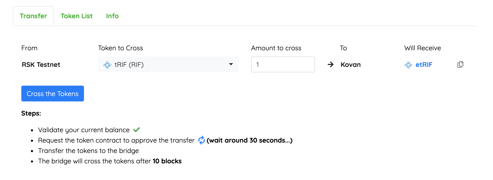
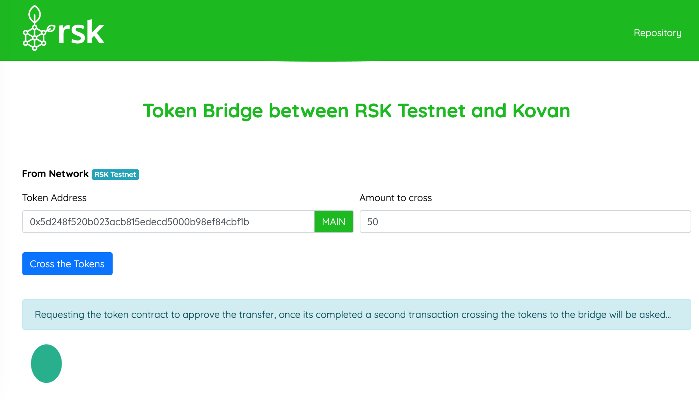
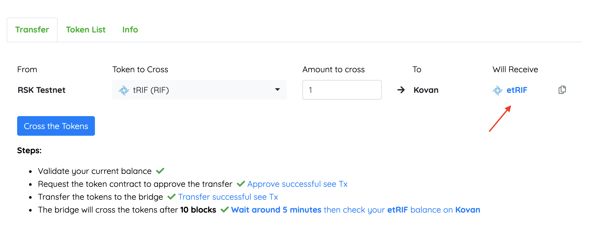

# Token Bridge Dapp Guide

### Description
This guide describes the steps to transfer tokens using the Web Interface for the RSK Tokenbridge system. Please refer to the project documentation if you’d like to know more about how this bridge works.

It is possible to test the transfer of tokens between RSK and Kovan networks using the RSK Tokenbridge web interface. This will require access to a Chrome or Chromium web browser and install one of the following wallets [Metamask with custom network](https://developers.rsk.co/develop/apps/wallets/metamask/) or [Nifty Wallet](https://chrome.google.com/webstore/detail/nifty-wallet/jbdaocneiiinmjbjlgalhcelgbejmnid). The derivation path used in RSK is different from the one used in Ethereum, so you need to [use a custom network](https://developers.rsk.co/tutorials/resolve-nifty-issue/#add-rsk-as-custom-node) to keep the same address in RSK and Ethereum.

## Steps
Go to the Dapp [https://tokenbridge.rsk.co/](https://tokenbridge.rsk.co/) for mainnet or [https://testnet.tokenbridge.rsk.co/](https://testnet.tokenbridge.rsk.co/) for testnet.
First **log in** with your wallet (metamask or nifty) and select the network of your choice, in this case we will use **RSK Testnet**.

  

If everything is correct, you will see the following screen:

  

Then **select the token** that you want to transfer. For example, tRIF token (you can obtain them from the [Rif Faucet](https://faucet.rifos.org/)).

  

Once you have selected it, enter the amount you want to transfer, then click **Cross the Tokens button**.

  

As soon as the process starts, you will see a **list of the steps needed** to cross the tokens.

  

The second and third step will show a message pop-up to confirm the transaction, **submit the transaction**. The following image gives an example of the confirmation popup. This **steps require around 30 seconds each** for the transaction to be mined.

  

Once all the steps are done, you have to **wait around 5 minutes in testnet or 1 hour in mainnet** for the tokens to cross. You can **check the  token contract on the other network** by clicking on the symbol (red arrow on the image).
You can also change the network on you wallet (in this case we would change to Kovan). To do this, add the token to your wallet using the address of the crossed token contract (red arrow on the image) in your wallet.

  

This address can be used to verify the balance and confirm that the tokens were effectively transferred to the other network. 

If you want to **cross back the tokens is the same process** but you'll need to select the other network in your wallet, in this case it's the Kovan network.
