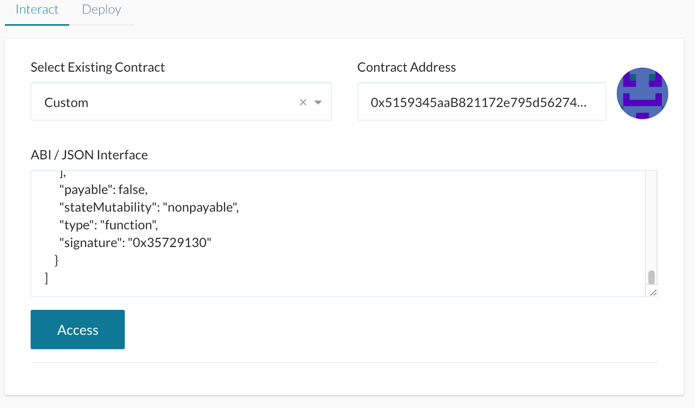

Decentralized bridge interaction guide
===

This guide describes the necessary steps to perform a token transfer between two blockchain networks, hereinafter referred to as **Mainchain** and **Sidechain**, through interaction with special contracts that make up a subsystem called **TokenBridge**.

The test performed uses the RSK (with a local regtest node) and Ethereum (through the Ganache client) nodes as Mainchain and Sidechain respectively. The demonstration images to interact with both Blockchain were taken from the MyCrypto application. Alternatively, MyEtherWallet or similar can be used which will give the same results.

### Preconditions

The following list summarizes the tools and components that are necessary to go through this guide.

* Mainchain network
* Sidechain network
* Blockchain interface to interact with contracts
* Mainchain account with funds
* Contract addresses and JSON ABIs in Mainchain for IERC20 token (or similar) and Bridge contract

* Contract address and JSON ABI in Sidechain for  Bridge contract
* Submitter process crossing transactions from Mainchain to Sidechain

In particular for this use case, it was used:

* RSK (regtest node)
* Ethereum (through Ganache)
* MyCrypto

### Setup

Start by connecting the blockchain interface client to the Mainchain network. In this case the connection is to a custom local node that was previously started.

  

---

Then access your account using one of the methods available in your application. Make sure to have funds available before continuing.

## Token transfer

The first step to perform the cross-transfer consists in the interaction with the contract located in the Mainchain that contains the tokens to be sent. In this case we will use an `IERC20` contract as an example, but it is not subject to any custom functionality so any other ERC20-based contract can be used.

To continue enter the `address` of the contract and its `JSON ABI` interface

---

Afterwards select the `approve` method and complete the parameters with the information of the recipient and the amount we want to send in unit of wei. The spender address will be the address of the so-called Bridge contract in the Mainchain network that will be used as an intermediary for the transfer.

---

Then confirm the gas price, write and sign the transaction and finally send it. You might be asked to enter the wallet once again before confirming.

  

---

As a result, the corresponding transaction identifier will be obtained. It is recommended to wait for the transaction to be mined and confirmed. You can go to the TX Status section to verify its status.

---

## Receive tokens

Next, access the Bridge contract in the Mainchain, entering its address (which is where we originally sent the tokens to) and the JSON ABI.

---

On this occasion invoke the receiveTokens method placing the IER20 contract address in the tokenToUse input and the amount in unit of wei that we wish to receive.

---

Again, write, sign and confirm the transaction and wait for it to be approved.

  

---

Once this transaction on Bridge contract is processed, the submitter service will identify the event and cross the information to the Sidechain. The submitter might be configured to wait a few blocks before transferring transactions.

## Switch networks

The next step is to connect the Blockchain interface client to the Sidechain, where the tokens will be received. In this case we use the Ganache client with the corresponding contracts previously deployed.

Then connect to the Bridge's Sidechain contract using the corresponding address and JSON ABI once again. This time call the mappedTokens method passing as a parameter the address of the IERC20 contract of the Mainchain that was previously used. The result of this operation will be the address of the associated contract on the Sidechain that holds the transferred tokens.

---

## Validating result

Using the obtained address from the previous step (`0x1684e1C7bd0225917C48F60FbdC7f47b2982a3C2`) and the IER20 ABI interface, let’s connect to the contract.

---

To confirm that the transfer was successful, verify the balance of the account used to send the funds from the Mainchain. Invoke the `balanceOf` method and note that the value has increased in the Sidechain.

---

Similarly, verify the contract `symbol`. Notice that in this case the value is `eMAIN` where ‘e’ refers to a transfer to the Ethereum Sidechain.

